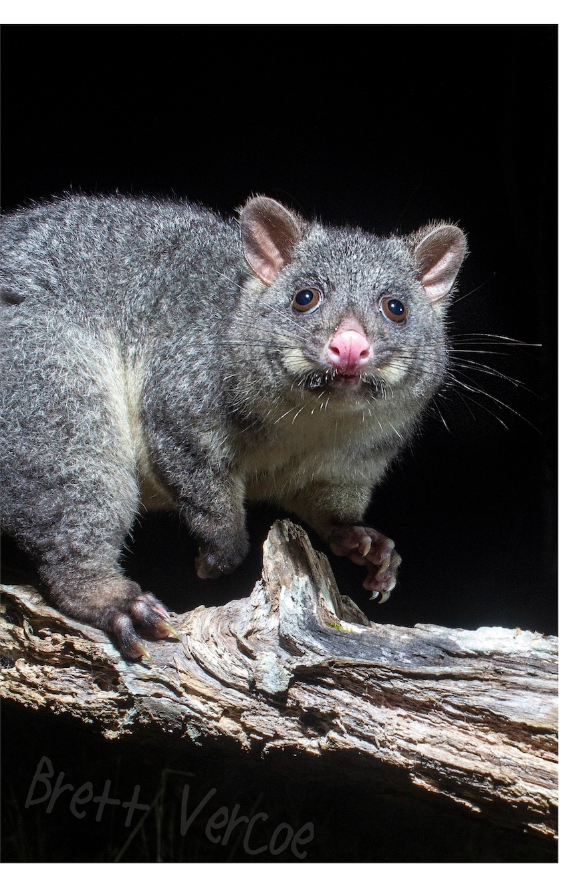
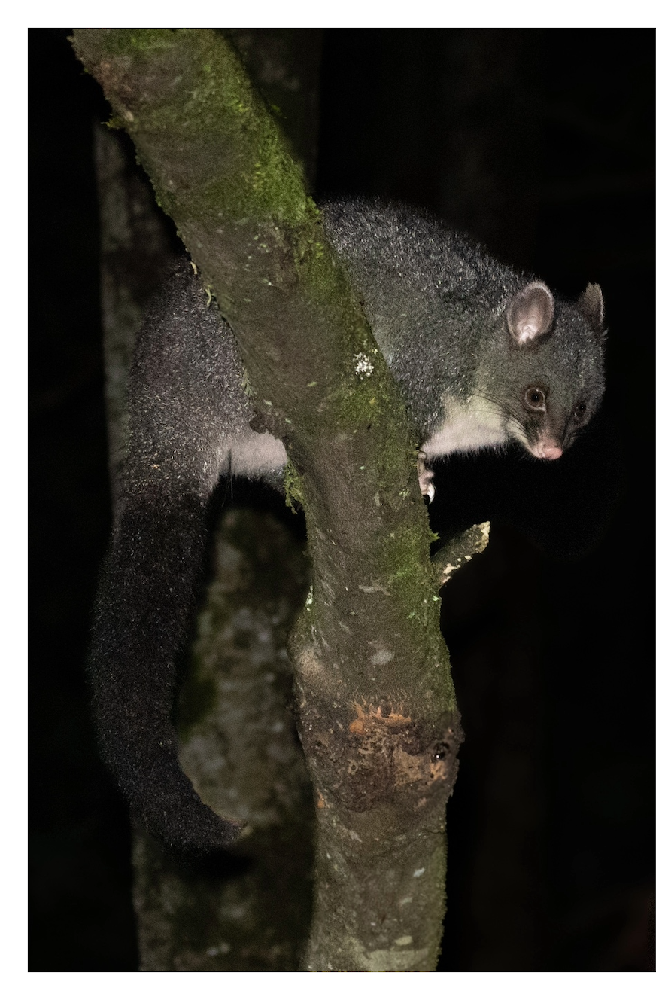

```{r setup, include=FALSE}
knitr::opts_chunk$set(echo = TRUE)
```

<br>

#### Dupuis, Geneviève
#### No d'étudiante&nbsp;: 22307619

---

---

## Introduction

En 1995, le scientifique David Lindenmayer entreprend une étude sur les variations morphométriques entre des populations de *Trichosurus caninus Ogilby*, des opossums connus sous le nom vernaculaire anglais de *mountain brushtail possums*. Pour réaliser l’étude, des opossums sont capturés sur sept sites répartis entre le sud de Victoria et le centre de Queensland, dans l’est de l’Australie, et neuf mesures morphologiques sont consignées pour chaque animal. Lindenmayer et son équipe observent des variations significatives entre les populations du sud et du nord et publient leurs résultats dans l'[*Australian Journal of Zoology*](https://www.publish.csiro.au/zo/ZO9950449). Une seconde étude, dont les résultats sont aussi publiés dans l'[*Australian Journal of Zoology*](https://www.publish.csiro.au/zo/ZO01047) en 2002, permet au chercheur de démontrer qu’en plus des variations morphométriques, il existe des différences constantes entre les caractéristiques génétiques des deux populations. À la suite de ces conclusions, les opossums étudiés sont classés en deux espèces distinctes de *Trichosurus*, soit *T. caninus* pour la population du nord (du centre de New South Wales au centre de Queensland), et *T. cunninghami* pour la population du sud (Victoria).

L'objectif de ce projet est de déterminer s’il est possible d’observer un dimorphisme entre les opossums étudiés à partir des mesures consignées par Lindenmayer, d’une part en fonction du sexe, et d’autre part en fonction de la région. Les relations entre les caractéristiques morphologiques et le sexe seront d'abord explorées, et l’hypothèse selon laquelle la circonférence du ventre des femelles serait plus grande que celle du ventre des mâles en raison de leur marsupium sera vérifiée. Les relations entre les caractéristiques morphologiques et la région seront ensuite explorées dans le but d’identifier quelles caractéristiques sont les plus corrélées à l’habitat. À partir des résultats obtenus, un modèle sera développé pour prédire l'espèce à laquelle appartient un opossum en fonction des ses mesures morphologiques.

Les données utilisées sont disponibles dans le paquetage DAAG de R. Elles incluent les mesures morphologiques, [*Possum Measurements*](https://search.r-project.org/CRAN/refmans/DAAG/html/possum.html), et la localisation des sites de capture des opossums, [*Possum Sites*](https://search.r-project.org/CRAN/refmans/DAAG/html/possumsites.html). De plus, des données spatiales de l'Australie ont été récupérées sur le site [opendatasoft.com](https://data.opendatasoft.com/explore/dataset/georef-australia-state%40public/export/?disjunctive.ste_code&disjunctive.ste_name).

<br>

## 1. Rencontre avec les données

```{r, results='hide', warning=FALSE}
# Importation des données
library(DAAG)
data("possum")
data("possumsites")
```

<br>

### 1.1 Exploration du jeu de données `possum`

```{r}
dim(possum)
names(possum)
str(possum)
head(possum)
```

<br>

Le jeu de données comprend 104 observations d'opossums, et 14 variables les décrivant, soit&nbsp;:

* un numéro d'identification,
* le site sur lequel l'animal a été capturé,
* la région dans laquelle se trouve le site,
* le sexe,
* l'âge,
* la longueur de la tête,
* la largeur du crâne,
* la longueur totale,
* la longueur de la queue,
* la longueur du pied,
* la longueur de la conque de l'oreille,
* la distance entre le canthus médial et le canthus latéral de l'œil droit,
* la circonférence de la poitrine,
* la circonférence du ventre.


Toutes les variables sont numériques, à l'exception de `Pop` et `sex`, qui sont des facteurs de deux niveaux.

<br>

**Vérification de la présence de données manquantes**

```{r}
library(naniar)
summary(possum)
pct_miss(possum)
```

<br>

La fonction `summary`permet de constater qu'il y a des valeurs manquantes dans la variable `age` (deux valeurs manquantes) et `footlgth` (une valeur manquante), ce qui ne représente que 0,2&nbsp;% des données. Lors de l'analyse, ces valeurs seront ignorées pour la variable `age`, et remplacées par la moyenne pour la variable `footlgth`.

<br>

**Vérification de la présence de données aberrantes**

```{r, message=FALSE}
library(dlookr)
diagnose_outlier(possum)
```

<br>

Il semble y avoir des données aberrantes dans les variables `hdlngth`, `eye`, `chest`, `belly`, et particulièrement dans `skullw` (6,73&nbsp;%) et `taill` (3,85&nbsp;%). La visualisation des données permettra de mieux cerner ces valeurs pour les variables d'intérêt, et de les remplacer si nécessaire lors de l'analyse.

<br>

### 1.2 Nettoyage des données de `possum`

La variable `case`, qui identifie chaque opossum, n'est d'aucune utilité, car l'identifiant correspond au numéro de ligne du jeu de données. Elle est donc supprimée.

Afin d'améliorer la compréhension des données, la variable `Pop`est renommée et les valeurs des variables `Pop`et `sex`sont clarifiées.

```{r}
# Suppression de la colonne "case"
possum <- possum[ , -1]

# Variable "Pop" renommée pour plus de clarté
names(possum)[2] <- "region"

# Valeurs des facteurs renommées pour plus de clarté
possum$region <- as.character(possum$region)
possum$region[possum$region == "Vic"] <- "Victoria"
possum$region[possum$region == "other"] <- "NewSouthWales_Queensland"
possum$region <- as.factor(possum$region)
levels(possum$region)

possum$sex <- as.character(possum$sex)
possum$sex[possum$sex == "m"] <- "male"
possum$sex[possum$sex == "f"] <- "female"
possum$sex <- as.factor(possum$sex)
levels(possum$sex)

head(possum)
```

<br>

### 1.3 Exploration du jeu de données `possumsites`

```{r}
dim(possumsites)
names(possumsites)
head(possumsites)
row.names(possumsites)
```
<br>

Le jeu de données de `possumsites`comprend 7 observations et 3 variables, soit la longitude, la latitude et l'altitude. Les sites sont identifiés par leur nom, qui apparaît dans le nom des lignes du jeu de données.

<br>

### 1.4 Nettoyage des données de `possumsites`

La variable `altitude` est supprimée, car elle ne sera pas utile pour l'analyse. À l'inverse, le nom des sites est ajouté comme nouvelle variable, ainsi que le numéro qui leur est associé, numéro utilisé dans le jeu de données `possum`.

```{r}
# Retrait de la variable "altitude"
possumsites <- possumsites[ ,-3]

# Vérification que le nombre de sites correspond dans les deux jeux de données
unique(possum$site)

# Ajout des numéros et des noms des sites
possumsites$site_no <- c(1:7)
possumsites$site_name <- row.names(possumsites)
possumsites
```

<br>

---

## 2. Visualisation exploratoire des données

Afin d'assurer une cohérence dans la représentation graphique des données, des palettes de couleurs sont définies pour le sexe et la région. Ainsi, les données concernant les femelles seront représentées en jaune, celles concernant les mâles, en bleu, celles de la région de Victoria, en rose, et enfin, celles de la région de New South Wales et Queensland, en vert.

```{r}
# Définition des palettes de couleurs
sex_col <- c("gold1", "dodgerblue3")
region_col <- c("#7fbc41", "#ae377b")
sites_col <- c("#8e0152", "#f1b6da", "#e6f5d0", "#b8e186","#7fbc41", "#4d9221","#276419")
num_region_col <- c("black", "white")
```

<br>

### 2.1 Carte des sites de capture des opossums

Les sites de capture sont visualisés dans leur contexte, c'est-à-dire sur la carte de l'Australie et de ses États.

```{r, results='hide', message=FALSE}
# Chargement des biliothèques nécessaires
library(sf)
library(tmap)
library(mapview)
```

```{r}
# Chargement des données de l'Australie
australia <- st_read("georef-australia-state@public/georef-australia-state-millesime.shp")
australia
```

<br>

#### 2.1.1 Préparation des données

Les données de l'Australie sont au format *shapefile* d'ESRI et comprennent 9 éléments d'une géométrie de type multipolygone. Les États  où ont été capturés les opossums sont isolés dans de nouveaux objets spatiaux, en regroupant New South Wales et Queensland comme une seule région. Seuls le nom des États et la géométrie sont conservés, et les crochets et apostrophes autour des noms des États sont supprimés.

```{r}
# Régions où ont été capturés les opossums
victoria <- australia[1, c("ste_name", "geometry")]
nswales_queensland <- australia[c(2, 9), c("ste_name", "geometry")]

# Suppression des crochets et apostrophes
victoria$ste_name[victoria$ste_name == "['Victoria']"] <- "Victoria"
nswales_queensland$ste_name[nswales_queensland$ste_name == "['New South Wales']"] <- "New South Wales"
nswales_queensland$ste_name[nswales_queensland$ste_name == "['Queensland']"] <- "Queensland"
```

<br>

Pour être visualisées sur une carte, les données des sept sites sont converties en objet spatial, où les coordonnées deviennent une géométrie de type point. Comme les coordonnées sont au format longitude et latitude, le datum WGS 84 est utilisé pour définir le système de coordonnées de référence (code EPSG 4326).

```{r}
# Conversion des données de "possumsites" en objet spatial
possumsites_points <- st_as_sf(x = possumsites,
                               coords = c("Longitude", "Latitude"),
                               crs = 4326)
possumsites_points
```
<br>

Dans le jeu de données `possum`, chaque site est associé à une région. Cette information est d'abord extraite, ce qui permet de voir que les deux premiers sites sont associés à la région de Victoria, et les cinq autres font partie de la région qui regroupe New South Wales et Queensland. La région est ensuite ajoutée à l'objet spatial.

```{r}
# Extraction des sites et de leur région correspondante
possum_regions <- possum[ , c("site", "region")]
```

```{r, message=FALSE}
# Une seule ligne par site conservée
library(dplyr)
possum_regions_unique <- possum_regions |>
  group_by(site) |>
  filter(row_number() == 1)
possum_regions_unique
```


```{r}
# Ajout des régions à "possumsites_points"
possumsites_regions <- merge(x = possumsites_points, y = possum_regions_unique,
                         by.x = "site_no", by.y = "site")
possumsites_regions
```
<br>

Enfin, pour que les sites apparaissent suivant l'ordre de leur numéro dans la légende de la carte, la variable `site_name` est convertie en facteur, dont les niveaux correspondent à l'ordre des numéros des sites.

```{r}
# Affichage des noms des sites par ordre de numéro de site et non par ordre alphabétique
possumsites_regions$site_name <- factor(possumsites_regions$site_name,
                                        levels = row.names(possumsites))
levels(possumsites_regions$site_name)
```

<br>

#### 2.1.2 Création de la carte

```{r, fig.align='center'}
tm_shape(australia) + tm_borders() +
  tm_credits("Données de l'Australie récupérées \nsur le site opendatasoft.com",
             position = c("left", "bottom"), size = 0.65) +
  tm_shape(victoria) + tm_polygons(col = "grey76") + tm_text("ste_name", size = 0.7) +
  tm_shape(nswales_queensland) + tm_polygons(col = "grey93") + tm_text("ste_name", size = 0.7) +
  tm_shape(possumsites_regions) + tm_dots(col = "site_name", palette = sites_col, size = 0.8,
                                      title = "Sites de capture des opossums", title.size = 0.8,) +
  tm_text("site_no", col = "region", palette = num_region_col, size = 0.6, fontface = "bold", 
          legend.col.show = FALSE) +
  tm_layout(frame = FALSE, legend.outside = TRUE, legend.outside.position = "top",
            legend.text.size = 0.8, legend.title.fontface = "bold")
```

<br>

La visualisation de la carte de l'Australie rend évident le regroupement des sites de Cambarville et Bellbird en une même région, plus australe que celle des cinq autres sites.

Cependant, il est difficile de distinguer Whian Whian de Byrangery, les sites 4 et 5 respectivement, car les deux points semblent superposés. Leur proximité est vérifiée à l'aide des coordonnées géographiques d'abord, puis par une visualisation rapide à l'aide de la bibliothèque `mapview`.

```{r, results='hold', fig.align='center'}
# Visualisation rapide des deux sites très rapprochés
possumsites_points$geometry[4:5]
mapview(possumsites_points[3:6, ], legend = FALSE)
```

<br>

### 2.2 Visualisation des variables qualitatives et quantitatives discrètes

La répartition des variables qualitatives – soit le sexe et la région – et des variables quantitatives discrètes – le site et l'âge – est représentée graphiquement par des diagrammes en bâtons.

```{r, out.width="60%", fig.align='center'}
# Variable "sex"
barplot(table(possum$sex), main = "Nombre d'opossums observés par sexe",
        cex.main = 1.2,
        names.arg = c("Femelles", "Mâles"),
        xlab = "Sexe", ylab = "Nombre d'opossums", ylim = c(0, 70),
        cex.lab = 1.1, col = sex_col,
        width = 0.2, space = 0.8, xlim = c(0, 1))
```

```{r, out.width="60%", fig.align='center'}
# Variable "region"
barplot(table(possum$region), main = "Nombre d'opossums observés par région",
        cex.main = 1.2,
        xlab = "Région", ylab = "Nombre d'opossums", ylim = c(0, 70),
        cex.lab = 1.1, col = region_col,
        width = 0.2, space = 0.8, xlim = c(0, 1))
```

```{r, fig.height=6, fig.width=10}
# Variable "site"
barplot(table(possum$site), main = "Nombre d'opossums observés par site", cex.main = 1.2,
        names.arg = row.names(possumsites),
        xlab = "Site", ylab = "Nomnbre d'opossums", ylim = c(0, 35),
        cex.lab = 1.1, width = 0.7, xlim = c(0, 7), space = 0.4,
        col = sites_col)
```

```{r, fig.align='center'}
# Variable "age"
barplot(table(possum$age), main = "Nombre d'opossums observés par âge",
        cex.main = 1.2,
        xlab = "Âge", ylab = "Nombre d'opossums", ylim = c(0, 30),
        cex.lab = 1.1, col = "bisque3")
```

<br>

### 2.3 Visualisation des variables quantitatives continues

La répartition des variables quantitatives continues est représentée à l'aide de diagrammes en boîte.

```{r}
# Création d'un vecteur des noms de variables en français
variables <- c("Longueur de la tête", "Largeur du crâne", "Longueur totale",
               "Longueur de la queue", "Longueur du pied", "Longueur de la conque de l'oreille",
               "Largeur de l'œil", "Circonférence de la poitrine", "Circonférence du ventre")
```

```{r, fig.height=12, fig.width=8}
# Représentation des 9 variables
par(mfrow = c(3, 3))
for (i in 1:9) {
    boxplot(possum[ , i + 4], main = variables[i])
}
```

<br>

### 2.4 Visualisation des relations entre les variables quantitatives continues

Pour avoir une meilleure idée des données morphométriques dans leur ensemble, les variables quantitatives continues sont représentées par paires, sur le même graphique.


```{r, results='hide', message=FALSE, warning=FALSE}
library(psych)
```


```{r, fig.height=8, fig.width=10}
par(mfrow = c(1, 1))
pairs.panels(possum[5:13],
             ellipses = FALSE, method = "pearson",
             hist.col = "bisque3", cex.cor = 1.8,
             scale = TRUE, stars = TRUE,
             main = "Distribution et corrélations des variables quantitatives")
```

Ce graphique permet de visualiser rapidement la distribution de chaque variable et de faire ressortir certaines corrélations, notamment entre la longueur du pied et la longueur de la conque de l'oreille, entre la longueur de la tête et la largeur du crâne, et entre la longueur de la tête et la longueur totale.

<br>

---

## 3. Analyse des données

<br>

### 3.1 Analyse d'un dimorphisme sexuel

L'objectif de cette section est de déterminer s'il existe un dimorphisme sexuel chez les opossums observés. Plus précisément, l'hypothèse selon laquelle la circonférence du ventre serait plus grande chez les femelles en raison de leur marsupium sera étudiée.

<br>

#### 3.1.1 Portrait moyen d'un opossum en fonction du sexe

Les moyennes de chaque variable sont comparées entre les femelles et les mâles.

```{r}
possum_means <- possum |>
  group_by(sex) |>
  summarise(across(hdlngth:belly, ~ mean(.x, na.rm = TRUE)))

possum_means
```

<br>

Ce tableau ne suggère aucun dimorphisme sexuel, car les moyennes diffèrent très peu entre les femelles et les mâles.

<br>

#### 3.1.2 Visualisation des données en fonction du sexe

De possibles corrélations entre les caractéristiques morphologiques et le sexe sont explorées à l'aide d'une représentation graphique, où les données des femelles apparaissent en jaune, et celles des mâles, en bleu.

```{r, fig.height=8, fig.width=10}
pairs.panels(possum[5:13],
             ellipses = FALSE, method = "pearson",
             hist.col = "bisque3", cex.cor = 1.8,
             scale = TRUE, stars = TRUE,
             pch = 21 + as.numeric(possum$sex),
             bg = sex_col[possum$sex],
             main = "Corrélations en fonction du sexe")
```

Ce graphique ne permet pas de repérer de corrélation évidente entre le sexe et l'une ou l'autre des caractéristiques morphologiques. La répartion des variables quantitatives continues en fonction du sexe est donc visualisée séparément pour chaque variable.

```{r}
# Définition d'une fonction
box_graph_sex <- function(data, variable, title, ylab) {
  boxplot(variable ~ data$sex, names = c("Femelles", "Mâles"),
          col = sex_col,
          main = paste(title, "\nen fonction du sexe"),
          ylab = paste(ylab, "(cm)"), xlab = "Sexe", cex.main = 1.05)
}
```

```{r, results='hold', out.width="100%"}
# Diagrammes en boîte pour chaque variable en fonction du sexe
par(mfrow = c(1, 3))
box_graph_sex(possum, possum$hdlngth, variables[1], "Tête")
box_graph_sex(possum, possum$skullw, variables[2], "Crâne")
box_graph_sex(possum, possum$totlngth, variables[3], "Longueur")
box_graph_sex(possum, possum$taill, variables[4], "Queue")
box_graph_sex(possum, possum$footlgth, variables[5], "Pied")
box_graph_sex(possum, possum$earconch, variables[6], "Oreille")
box_graph_sex(possum, possum$eye, variables[7], "Œil")
box_graph_sex(possum, possum$chest, variables[8], "Poitrine")
box_graph_sex(possum, possum$belly, variables[9], "Ventre")
```

Malgré quelques variations, la visualisation des données ne permet toujours pas de croire qu'il existe un dimorphisme sexuel chez les opossums observés.

<br>

#### 3.1.3 Opossums en âge de reproduction

L'hypothèse de départ étant de comparer la taille des ventres des femelles et des mâles en raison de la poche marsupiale des femelles, une nouvelle question se pose&nbsp;: une différence de la circonférence du ventre est-elle observable seulement pour les opossums en âge de reproduction?

D'après le site *Animal Diversity Web*, une base de données de l’Université du Michigan sur la biologie des animaux, l'âge de maturité sexuelle du [*Trichosurus caninus*](https://animaldiversity.org/accounts/Trichosurus_caninus/) est de 2 à 3 ans, et celui du [*Trichosurus cunninghami*](https://animaldiversity.org/accounts/Trichosurus_cunninghami/) est aussi de 2 à 3 ans pour les mâles, et de 2 à 5 ans pour les femelles. Les observations qui correspondent à des opossums de 2 et 3 ans sont donc isolées et la circonférence du ventre en fonction du sexe est visualisée à l'aide d'un diagramme en boîte.

```{r, warning=FALSE}
# Sous-ensemble des opossums en âge de reproduction
sex_maturity <- subset(possum, age == c(2, 3), na.rm = TRUE)
```

```{r, out.width="60%", fig.align='center'}
# Visualisation de la variable "belly"
box_graph_sex(sex_maturity, sex_maturity$belly, variables[9], "Ventre")
```


Il ressort de ce diagramme que les mâles ont le ventre un peu plus gros que les femelles. Comme cela est possiblement dû au fait que les mâles en âge de reproduction sont globalement plus gros que les femelles, la moyenne de chaque caractéristique morphologique est comparée entre les deux groupes.

```{r}
# Comparaison de la taille globale des opossums de 2 et 3 ans
sm_means <- sex_maturity |>
  group_by(sex) |>
  summarise(across(hdlngth:belly, ~ mean(.x, na.rm = TRUE)))
sm_means
```
<br>

Effectivement, les mâles de 2 et 3 ans sont en moyenne globalement plus gros que les femelles du même âge. L'âge de la maturité sexuelle ne donne donc aucune information supplémentaire par rapport à l'hypothèse. De plus, comme le nombre d'observations est peu élevé, l'analyse statistique sera effectuée sur toutes les observations, sans tenir compte de l'âge.

<br>

#### 3.1.4 Analyse statistique

L'analyse statistique servira à tester les hypothèses statistiques suivantes concernant les moyennes de la circonférence du ventre des deux sexes&nbsp;:

*H*~0~&nbsp;: $\mu$ ~ventre~ ~femelles~ ≤ $\mu$ ~ventre~ ~mâles~

*H~a~*&nbsp;: $\mu$ ~ventre~ ~femelles~ > $\mu$ ~ventre~ ~mâles~

$\alpha$ = 0.05


L'analyse se fera à l'aide d'un test *t*.

<br>

**Préparation des données pour l'analyse**

L'exploration initiale des données avait montré la présence probable de données aberrantes dans la variable `belly`. La méthode de l'écart-type est utilisée pour les détecter.

```{r, results='hold'}
# Détection des valeurs aberrantes avec la méthode de l'écart-type
lower_belly <- mean(possum$belly) - (1.5 * sd(possum$belly))
upper_belly <- mean(possum$belly) + (1.5 * sd(possum$belly))
print(paste("Limite inférieure :", round(lower_belly, digits = 2)))
print(paste("Limite supérieure : ", round(upper_belly, digits = 2)))

index_belly_outliers <- which(possum$belly < lower_belly | possum$belly > upper_belly)
print(paste("Nombre de valeurs hors de l'écart-type :", length(index_belly_outliers)))
```

<br>

Cette méthode détecte 11 valeurs en dehors de l'écart type, ce qui est beaucoup plus que les 2 valeurs identifiées par la fonction `diagnose`. Une visualisation des données permettra d'avoir une meilleure idée de la distribution des valeurs.

```{r, fig.align='center'}
plot(belly ~ age, data = possum, main = "Taille du ventre en fonction de l'âge",
     pch = 20, xlab = "Âge", ylab = "Ventre (cm)", cex.lab = 0.95, cex.main = 1.05)
```

Le graphique montre que les valeurs sont en fait assez rapprochées. Par conséquent, seules la valeur minimale et la valeur maximale sont remplacées par la moyenne.

```{r, results='hold'}
# Identification des deux valeurs extrêmes
which.min(possum$belly)
which.max(possum$belly)
```
```{r, results='hold'}
# Remplacement des valeurs extrêmes par la moyenne
possum[c(21, 39), 13]
possum[c(21, 39), 13] <- mean(possum$belly)
possum[c(21, 39), 13]
```

<br>

Les données sont maintenant séparées par sexe, en ne conservant que la variable d'intérêt pour l'analyse statistique.

```{r, results='hold'}
females <- possum[possum$sex == "female", "belly"]
males <- possum[possum$sex == "male", "belly"]
print(paste("Nombre de femelles :", length(females)))
print(paste("Nombre de mâles :", length(males)))
```

<br>

Les deux groupes obtenus sont de taille inégale, avec un ratio approximatif de trois mâles pour deux femelles.

<br>

**Vérification des suppositions**

Le test *t* sur deux groupes indépendants requiert l'indépendance des observations, la normalité des résidus et l'homogénéité des variances entre les deux groupes.

Toutes les mesures morphologiques ont été prélevées sur des opossums différents, capturés au hasard sur différents sites australiens. L'indépendance des observations est donc respectée.

La normalité des résidus et l'homoscédasticité sont vérifiées à l'aide de méthodes graphiques, ainsi qu'avec un test formel pour la normalité des résidus.

```{r}
# Calcul des résidus
res_females <- females - mean(females)
res_males <- males - mean(males)
res_sex <- c(res_females, res_males)

# Test formel Anderson-Darling
library(nortest)
ad.test(res_sex)
```

```{r, results='hold', fig.align='center'}
# Graphique quantile-quantile
par(mfrow = c(1, 2))
qqnorm(res_sex, xlab = "Quantiles théoriques", ylab = "Quantiles observés",
       main = "Graphique quantile-quantile", cex.main = 0.95)
qqline(res_sex)

# Homoscédasticité
possum$res_sex <- res_sex
boxplot(res_sex ~ sex, data = possum, names = c("Femelles", "Mâles"),
        col = sex_col,
        main = "Observation de la variance\nà partir des résidus",
        ylab = "Résidus", xlab = "Sexe", cex.main = 0.95)
```

Le test d'Anderson-Darling, avec une valeur de *P*&nbsp;=&nbsp;0,3648, et le graphique quantile-quantile indiquent que les résidus suivent une distribution normale. Cependant, les variances sont hétérogènes, possiblement parce que les deux groupes sont inégaux en taille et le nombre d'observations, peu élevé. Par conséquent, l'analyse se fera avec un test *t* de Welch.

<br>

```{r}
t.test(x = females, y = males, data = possum, var.eqal = FALSE, alternative = "greater")
```

<br>

**Interprétation des résultats**

Avec *P*(*t*~95~ ≥ 1,02)&nbsp;=&nbsp;0,1556, la probabilité d'observer une valeur de *t*&nbsp;=1,02 (ou plus grande) dans une population où *H*~0~ est vraie est suffisamment élevée pour ne pas rejeter l'hypothèse nulle. Ainsi, il n'est pas possible de conclure que la taille du ventre des femelles est plus grande que celle du ventre des mâles en raison de leur marsupium.

Par ailleurs, d'après la visualisation exploratoire des données, aucune autre caractéristique morphologique ne semble varier significativement en fonction du sexe. Par conséquent, aucune autre analyse statistique ne sera effectuée concernant le dimorphisme sexuel.

<br>

### 3.2 Analyse d'un dimorphisme géographique

L'objectif de cette section est de confirmer qu'il existe un dimorphisme géographique chez les opossums observés, c'est-à-dire des traits morphologiques qui diffèrent entre les individus de la région de Victoria et celle de New South Wales et Queensland, tel que l'ont conclu les chercheurs Lindenmayer et son équipe.

<br>

#### 3.2.1 Portrait moyen d'un opossum en fonction de la région

Les moyennes de chaque variable sont comparées entre les opossums des deux régions.

```{r}
region_means <- possum |>
  group_by(region) |>
  summarise(across(hdlngth:belly, ~ mean(.x, na.rm = TRUE)))

region_means
```

<br>

La comparaison des moyennes de chaque variable entre les régions fait ressortir des écarts de taille pour la longueur du pied et la conque de l'oreille, avec des différences de moyennes de 7&nbsp;cm et 7,3&nbsp;cm respectivement. Dans une moindre mesure, la moyenne de la longueur de la queue varie de 2&nbsp;cm entre les deux groupes. Pour toutes les autres variables, la différence est minime, voire inexistante, variant entre 0 et 1&nbsp;cm.

<br>

#### 3.2.2 Visualisation des données en fonction de la région

De possibles corrélations entre les caractéristiques morphologiques et la région sont maintenant explorées à l'aide d'une représentation graphique, où les données de la population de Victoria sont représentées en rose, et celles de la population de New South Wales et Queensland, en vert.

```{r, fig.height=8, fig.width=10}
pairs.panels(possum[5:13],
             ellipses = FALSE, method = "pearson",
             hist.col = "bisque3", cex.cor = 1.8,
             scale = TRUE, stars = TRUE,
             pch = 21 + as.numeric(possum$sex),
             bg = region_col[possum$region],
             main = "Corrélations en fonction de la région")
```

Cette visualisation permet de corroborer des différences marquées entre les deux populations d'opossums. Comme dans le tableau des moyennes, la longueur du pied et la longueur de la conque de l'oreille sont les deux caractéristiques morphologiques pour lesquelles les deux groupes semblent les plus distincts. Le graphique fait d'ailleurs ressortir une forte corrélation entre ces deux variables (corrélation déjà identifiée à la section 2.4). Encore une fois, la différence pour la longueur de la queue est moins évidente, mais elle est tout de même suggérée.

La répartition des trois caractéristiques morphologiques mises en évidence précédement est représentée graphiquement selon la région, sous forme de diagrammes en boîte.


```{r}
# Définition d'une fonction
box_graph_rg <- function(data, variable, title, ylab) {
  boxplot(variable ~ data$region,
          col = region_col,
          names = c("NSW_Q", "Victoria"),
          main = paste(title, "\nen fonction de la région"),
          ylab = paste(ylab, "(cm)"), xlab = "Région", cex.main = 1.05)
}
```

```{r, out.width="100%"}
# Visualisation des trois variables d'intérêt en fonction de la région
par(mfrow = c(1, 3))
box_graph_rg(possum, possum$earconch, variables[6], "Oreille")
box_graph_rg(possum, possum$footlgth, variables[5], "Pied")
box_graph_rg(possum, possum$taill, variables[4], "Queue")
```

Si les opossums de la région de Victoria ont de plus grandes oreilles et de plus longs pieds que leurs voisins de New South Wales et Queensland, ils ont en revanche la queue un peu plus courte. 
Par ailleurs, il est intéressant de noter qu'une valeur de longueur de la conque de l'oreille est nettement inférieure aux autres pour la région de Victoria.

<br>

#### 3.2.3 Analyses statistiques

Des test d'hypothèse sur deux groupes seront effectuées pour vérifier si la différence entre les opossums des deux régions est significative, et non seulement due à l'échantillon, pour les trois caractéristiques identifiées par la visualisation des données.

<br>

Les hypothèses statistiques sont les suivantes, et seront testées séparément pour chaque caractéristique&nbsp;:


*H*~0~&nbsp;: $\mu$ ~oreillle/pied/queue~ ~Victoria~ = $\mu$ ~oreille/pied/queue~ ~NSW_Queensland~

*H~a~*&nbsp;: $\mu$ ~oreillle/pied/queue~ ~Victoria~ ≠ $\mu$ ~oreille/queue/pied~ ~NSW_Queensland~

$\alpha$ = 0.05

<br>

**Préparation des données**

L'exploration initiale des données avait fait ressortir la présence d'une donnée manquante pour la variable `footlgth`, et la présence probable de données aberrantes dans la variable `taill`.

Pour éviter de supprimer l'ensemble des mesures de l'opossum pour lequel la longueur de pied n'a pas été consignée, la valeur manquante est remplacée par la moyenne de la région à laquelle cet opossum appartient.

```{r}
# Détection de la valeur manquante
which(is.na(possum$footlgth))
# Identification de la région liée à l'observation
possum[41, 2]
# Remplacement de la valeur manquante par la moyenne de la région
possum[41, 9] <- region_means[2, 6]
possum[41, 9]
```
<br>

La méthode de l'écart-type est maintenant utilisée pour repérer les valeurs aberrantes dans la variable `taill`.

```{r, results='hold'}
# Détection des valeurs aberrantes avec la méthode de l'écart-type
lower_tail <- mean(possum$taill) - (1.5 * sd(possum$taill))
upper_tail <- mean(possum$taill) + (1.5 * sd(possum$taill))
print(paste("Limite inférieure :", round(lower_tail, digits = 2)))
print(paste("Limite supérieure : ", round(upper_tail, digits = 2)))

index_tail_outliers <- which(possum$taill < lower_tail | possum$taill > upper_tail)
print(paste("Nombre de valeurs hors de l'écart-type :", length(index_tail_outliers)))
```

<br>

Encore une fois, la méthode de l'écart type identifie beaucoup plus de données aberrantes que la fonction `diagnose` ne l'avait fait, soit 17 valeurs plutôt que 4. Une visualisation des données pourrait aider à diagnostiquer les valeurs problématiques.

```{r, fig.align='center'}
par(mfrow = c(1, 1))
plot(taill ~ totlngth, data = possum,
     main = "Longueur de la queue en fonction de la longueur totale",
     pch = 20, xlab = "Longueur totale (cm)", ylab = "Queue (cm)", cex.lab = 0.95, cex.main = 1.05)
```

La visualisation fait ressortir une forte corrélation entre la longueur de la queue et la longueur totale, et les mesures semblent toutes plausibles. Elles seront donc toutes conservées telles quelles pour l'analyse statistique. 

<br>

**Vérification des suppositions**

La supposition d'indépendance des données a déjà été vérifiée. La normalité des résidus et l'homoscédasticité sont vérifiées à l'aide de méthodes graphiques, pour chaque caractéristique analysée.

<br>

##### 3.2.3.1 Analyse statistique de la longueur de la conque de l'oreille

```{r, results='hold'}
# Séparation des données par région en ne gardant que la variable d'intérêt
victoria_ear <- possum[possum$region == "Victoria", "earconch"]
nswq_ear <- possum[possum$region == "NewSouthWales_Queensland", "earconch"]
print(paste("Nombre d'opossums à Victoria :", length(victoria_ear)))
print(paste("Nombre d'opossums à New South Wales et Queensland :", length(nswq_ear)))
```

<br>

Cette fois encore, les deux groupes sont de taille inégale, mais la variation est moindre qu'entre les groupes liés au sexe.

<br>

```{r}
# Calcul des résidus pour la conque de l'oreille
res_victoria_ear <- victoria_ear - mean(victoria_ear)
res_nswq_ear <- nswq_ear - mean(nswq_ear)
res_ear <- c(res_victoria_ear, res_nswq_ear)
```

```{r, results='hold', fig.align='center'}
# Vérification des suppositions à l'aide de méthodes graphiques
par(mfrow = c(1, 2))

## Graphique quantile-quantile
qqnorm(res_ear, xlab = "Quantiles théoriques", ylab = "Quantiles observés",
       main = "Graphique quantile-quantile", cex.main = 0.95)
qqline(res_ear)

# Homoscédasticité
possum$res_ear <- res_ear
boxplot(res_ear ~ region, data = possum,
        col = region_col,
        main = "Observation de la variance\nà partir des résidus",
        ylab = "Résidus", xlab = "Région", cex.main = 0.95)
```

La vérification des suppositions indique que les résidus suivent une distribution normale et que l'homoscédasticité est respectée. L'analyse peut donc se faire avec un test *t* de Student.

<br>

```{r}
t.test(earconch ~ region, data = possum, var.equal = TRUE)
```
<br>

**Interprétation des résultats**

Le test *t* montre que la probabilité d'observer une valeur de *t* = -19,03 dans une population où *H*~0~ est vraie est très faible (*P*&nbsp;<&nbsp;0,0001). L'hypothèse nulle est donc rejetée, ce qui permet de conclure qu'il existe une différence significative de longueur de la conque de l'oreille entre les opossums des deux régions.

<br>

##### 3.2.3.2 Analyse statistique de la longueur du pied

```{r}
# Séparation des données par région en ne gardant que la variable d'intérêt
victoria_foot <- possum[possum$region == "Victoria", "footlgth"]
nswq_foot <- possum[possum$region == "NewSouthWales_Queensland", "footlgth"]
```


```{r}
# Calcul des résidus pour la longueur du pied
res_victoria_foot <- victoria_foot - mean(victoria_foot)
res_nswq_foot <- nswq_foot - mean(nswq_foot)
res_foot <- c(res_victoria_foot, res_nswq_foot)
```

```{r, results='hold', fig.align='center'}
# Vérification des suppositions à l'aide de méthodes graphiques
par(mfrow = c(1, 2))

## Graphique quantile-quantile
qqnorm(res_foot, xlab = "Quantiles théoriques", ylab = "Quantiles observés",
       main = "Graphique quantile-quantile", cex.main = 0.95)
qqline(res_foot)

# Homoscédasticité
possum$res_foot <- res_foot
boxplot(res_foot ~ region, data = possum,
        col = region_col,
        main = "Observation de la variance\nà partir des résidus",
        ylab = "Résidus", xlab = "Région", cex.main = 0.95)
```

Le graphique quantile-quantile indique que les résidus suivent assez bien une distribution normale. La supposition d'homoscédasticité est aussi respectée, l'analyse peut donc se faire ici aussi à l'aide d'un test *t* de Student.

<br>

```{r}
t.test(footlgth ~ region, data = possum, var.equal = TRUE)
```
<br>

**Interprétation des résultats**

Le résultat du test *t* pour la longueur du pied est similaire au test précédent, avec une probabilité très faible (*P*&nbsp;<&nbsp;0,0001) d'observer une valeur de *t* = -13,23 dans une population où *H*~0~ est vraie. L'hypothèse nulle est donc rejetée encore une fois, ce qui permet de conclure qu'il existe aussi une différence significative de longueur du pied entre les opossums des deux régions.

<br>

##### 3.2.3.3 Analyse statistique de la longueur de la queue

```{r}
# Séparation des données par région en ne gardant que la variable d'intérêt
victoria_tail <- possum[possum$region == "Victoria", "taill"]
nswq_tail <- possum[possum$region == "NewSouthWales_Queensland", "taill"]
```


```{r}
# Calcul des résidus pour la longueur de la queue
res_victoria_tail <- victoria_tail - mean(victoria_tail)
res_nswq_tail <- nswq_tail - mean(nswq_tail)
res_tail <- c(res_victoria_tail, res_nswq_tail)
```


```{r, fig.align='center'}
# Vérification des suppositions
par(mfrow = c(1, 2))

## Graphique quantile-quantile
qqnorm(res_tail, xlab = "Quantiles théoriques", ylab = "Quantiles observés",
       main = "Graphique quantile-quantile", cex.main = 0.95)
qqline(res_tail)

# Homoscédasticité
possum$res_tail <- res_tail
boxplot(res_tail ~ region, data = possum,
        col = region_col,
        main = "Observation de la variance\nà partir des résidus",
        ylab = "Résidus", xlab = "Région", cex.main = 0.95)
```

La vérification des suppositions à l'aide des graphiques confirme le respect de l'homoscédasticité, mais la distribution des résidus ne suit pas tout à fait la droite théorique. Des vérifications supplémentaires sont donc faites à l'aide de tests formels.

<br>

```{r}
# Test formel d'Anderson-Darling
ad.test(res_tail)
# Test formel de Cramer-von Mises
cvm.test(res_tail)
# Test formel de Shapiro-Wilk
shapiro.test(res_tail)
```

<br>

Aucun test formel ne confirme le respect de la normalité des résidus, les valeurs de *P* étant toutes inférieures au seuil de signification, fixé à 0,05.

La distribution de la variable est représentée par un histogramme.

```{r, fig.align='center'}
hist(possum$taill, main = "Distribution de la longueur de la queue",
        cex.main = 1.1,
        xlab = "Queue (cm)", ylab = "Fréquence", xlim = c(30, 44), ylim = c(0, 25),
        cex.lab = 0.95)
```

La distribution n'est pas symétrique, alors une transformation des données pourrait s'avérer utile. Cependant, après essais, ni la transformation logarithmique des données, ni la transformation au carré n'a permis de respecter la supposition de normalité des résidus. Par conséquent, l'analyse se fera à l'aide d'un test non paramétrique, celui de Mann-Whitney.

<br>

```{r}
# Test de Mann-Whitney
wilcox.test(taill ~ region, data = possum)
```
<br>

**Interprétation des résultats**

Le test effectué donne une valeur de probabilité bien inférieure au seuil de signification (*P*&nbsp;<&nbsp;0,0001), l'hypothèse nulle est donc rejetée. Cela permet de conclure que, malgré une différence moins marquée que pour les autres caractéristiques (longueur de la conque de l'oreille et longueur du pied), la différence de longueur de queue chez les opossums des deux régions est bien significative.

<br>

### 3.3 Conclusions

La section d'analyse des données cherchait à vérifier s'il existe un dimorphisme chez les opossums étudiés, dimorphisme sexuel d'une part, et dimorphisme géographique d'autre part. Aucune différence significative entre les femelles et les mâles n'ayant été observée à partir des données morphométriques, l'hypothèse du dimorphisme sexuel est rejetée. À l'inverse, les mesures de trois caractéristiques morphologiques diffèrent selon la région, ce qui confirme l'existence d'un dimorphisme géographique entre les deux populations d'opossums étudiés. Ces caractéristiques sont la longueur de la conque de l'oreille et celle du pied, deux caractéristiques plus petites chez les opossums du nord, et la longueur de la queue, plus courte chez les opossums du sud.

Il est à noter que ces conclusions concordent avec les résultats publiés par David Lindenmayer en 1995, dans son article [*Morphological Variation Among Populations of the Mountain Brushtail Possum, Trichosurus-Caninus Ogilby (Phalangeridae, Marsupialia)*](https://www.publish.csiro.au/zo/ZO9950449). 

<br>

---

## 4. Prédiction de l'espèce

L'objectif de cette section est de développer un modèle de classification permettant de prédire l'espèce à laquelle appartient un opossum, à partir des mesures de ses caractéristiques morphologiques les plus significatives.

L'espèce est d'abord ajoutée aux données, en associant le *Trichosurus cunninghami* à la région de Victoria, et le *Trichosurus caninus* à la région de New South Wales et Queensland.

```{r}
# Ajout de l'espèce aux données
possum$species <- as.character(possum$region)
possum$species[possum$region == "Victoria"] <- "cunninghami"
possum$species[possum$region == "NewSouthWales_Queensland"] <- "caninus"
possum$species <- as.factor(possum$species)
table(possum$species)
```

<br>

### 4.1 Arbre de décision

Avant de construire un modèle de classification, le gain d'information et le rapport de gain sont calculés pour chacune des neuf caractéristiques morphologiques.

```{r}
# Chargement des bibliothèques nécessaires
library(rpart)
library(FSelector)
```


```{r}
# Calcul du gain d'information
information.gain(species ~ hdlngth + skullw + totlngth + taill + footlgth + earconch + eye + chest + belly, data = possum, unit = "log2")
# Calcul du rapport de gain
gain.ratio(species ~ hdlngth + skullw + totlngth + taill + footlgth + earconch + eye + chest + belly, data = possum, unit = "log2")
```

<br>

Ces calculs confirment que c'est la longueur de la conque de l'oreille qui a le plus grand pouvoir discrimant entre les deux espèces d'opossums, suivie de la longueur du pied. La longueur de la queue a moins d'importance, et la longueur de la tête en a peu, mais presque autant que la longueur de la queue. Comme la longueur de la tête n'a pas fait l'ojbet d'une analyse statistique, elle ne sera pas incluse dans le modèle de classification.

<br>

En tenant compte des trois caractéristiques les plus importantes, un arbre de décision est dessiné.

```{r, fig.align='center', out.width="60%"}
tree_possum <- rpart(species ~ earconch + footlgth + taill, method = "class", data = possum)
plot(tree_possum, uniform = TRUE, margin = 0.1, main = "Arbre de décision pour les Trichosurus")
text(tree_possum, use.n = TRUE, fancy = TRUE, pretty = 0, all = TRUE)
```

Cet arbre confirme l'importance de la mesure de la conque de l'oreille, qui à elle seule arrive à classer 103 des 104 opossums dans la bonne espèce! L'observation mal classifiée correspond certainement à la faible valeur observée dans le diagramme en boîte de la section 3.2.2.

<br>

### 4.2 Classificateur bayésien

Toujours à partir des trois caractéristiques morphologiques identifiées par l'analyse et le calcul du gain d'information, un classificateur bayésien est développé. Les données sont d'abord divisées en une base d'entraînement comprenant 80&nbsp;% des observations, et une base de test comprenant le pourcentage restant des observations. 

```{r, results='hide', message=FALSE}
# Chargement des bibliothèques nécessaires
library(caTools)
library(e1071)
library(caret)
```


```{r}
# Séparation des données en base d'entraînement et base de test
set.seed(14)
sample_possum <- sample.split(possum$species, SplitRatio = 0.8)
possum_train <- subset(possum, sample_possum == TRUE)
possum_test <- subset(possum, sample_possum == FALSE)
table(possum_train$species)
table(possum_test$species)
```
<br>

Il y a 83 observations dans la base d'entraînement, et 21 dans la base de test. Les observations sont divisées proportionnellement selon l'espèce.

<br>

Le modèle est maintenant construit sur les données d'entraînement.

```{r}
# Classificateur bayésien
nB_model_possum <- naiveBayes(species ~ footlgth + earconch + taill, data = possum_train)
nB_model_possum
```

<br>

Les deux classes ne sont pas équiprobables, et les probabilités conditionnelles ont été calculées pour chaque caractéristique. Le classificateur peut maintenant être utilisé pour faire des prédictions sur les données de test.

```{r}
# Prédictions sur la base de test
nB_predict_possum <- predict(nB_model_possum, possum_test)
nB_predict_possum
```

<br>

Pour évaluer le modèle, la matrice de confusion est affichée, et le taux de bonne classification est calculé.

```{r}
# Matrice de confusion
nB_confusion <- table(true = possum_test$species, pred = nB_predict_possum)
nB_confusion
# Taux de bonne classification
nB_accuracy <- sum(diag(nB_confusion)) / sum(nB_confusion) * 100
print(paste("Taux de bonne classification :", round(nB_accuracy, digits = 2), "%"))

confusionMatrix(nB_confusion)
```
<br>

Les 12 *Trichosurus caninus* ont été classés comme *caninus*, et 8 des 9 *Trichosurus cunninghami* ont été classés comme *cunninghami*, ce qui correspond à un taux de bonne classification d'un peu plus de 95&nbsp;%. Les statistiques obtenues à l'aide de la fonction `confusionMatrix` confirment que le modèle est bon. En fait, avec si peu d'observations, il n'est pas possible de faire mieux, puisqu'une seule des observations de la base de test a été mal classée.

<br>

### 4.3 Estimateur des *K* plus proches voisins

Pour comparer, un nouveau modèle de classification est développé à l'aide de l'estimateur des *K* plus proches voisins. Les mêmes bases d'entraînement et de test que pour le classificateur bayésien sont utilisées, mais les données des trois caractéristiques morphologiques d'intérêt sont normalisées.

```{r, results='hide'}
# Chargement de la bibliothèque nécessaire
library(class)
```

```{r}
# Normalisation des données
train_scale <- scale(possum_train[, 8:10])
test_scale <- scale(possum_test[, 8:10])
head(train_scale)
head(test_scale)
```
<br>

Le modèle est d'abord développé simplement, c'est-à-dire avec une valeur de *K* égale à 1.

```{r}
# Développement du modèle
knn_model_possum <- knn(train = train_scale, test = test_scale, cl = possum_train$species, k = 1)
# Matrice de confusion
knn_confusion <- table(possum_test$species, knn_model_possum)
knn_confusion
# Taux de classification
knn_accuracy <- sum(possum_test$species == knn_model_possum) / length(possum_test$species) * 100
print(paste("Taux de bonne classification :", knn_accuracy, "%"))
```

<br>

Avec ce modèle, les 21 opossums sont classés correctement, ce qui n'est pas souhaitable. La valeur de *K* est donc variée, et le modèle est réévalué à chaque variation.

```{r, results='hold'}
# Évaluation du modèle et choix de la valeur de K 
# K = 3 
knn3_model_possum <- knn(train = train_scale, test = test_scale, cl = possum_train$species, 
					k = 3) 
knn_accuracy <- sum(possum_test$species == knn3_model_possum) / length(possum_test$species) * 100
print(paste("Taux de bonne classification avec k = 3 :", round(knn_accuracy, digits = 2), "%"))

# K = 5 
knn5_model_possum <- knn(train = train_scale, test = test_scale, cl = possum_train$species, 
					k = 5) 
knn_accuracy <- sum(possum_test$species == knn5_model_possum) / length(possum_test$species) * 100
print(paste("Taux de bonne classification avec k = 5 :", round(knn_accuracy, digits = 2), "%")) 

# K = 7 
knn7_model_possum <- knn(train = train_scale, test = test_scale, cl = possum_train$species, 
					k = 7) 
knn_accuracy <- sum(possum_test$species == knn7_model_possum) / length(possum_test$species) * 100
print(paste("Taux de bonne classification avec k = 7 :", round(knn_accuracy, digits = 2), "%"))

# K = 15 
knn15_model_possum <- knn(train = train_scale, test = test_scale, cl = possum_train$species, 
					k = 15) 
knn_accuracy <- sum(possum_test$species == knn15_model_possum) / length(possum_test$species) * 100
print(paste("Taux de bonne classification avec k = 15 :", round(knn_accuracy, digits = 2), "%"))
```

<br>

Avec une valeur de *K* égale à 3, le taux de classification obtenu est le même qu'avec le classificateur bayésien, soit 95,24&nbsp;%. Cependant, avec toute autre valeur de *K*, la classification est parfaite, avec un taux de 100&nbsp;%. Il faudrait certainement un bien plus grand nombre d'échantillons d'apprentissage que les 83 de ce projet pour que cet estimateur soit réellement performant.

<br>

---

## Conclusion

À partir des données morphométriques de 104 opossums de l’est de l’Australie, des *mountain brushtail possums* capturés sur sept sites différents par le scientifique David Lindenmayer et son équipe, ce projet visait à vérifier l’existence d’un dimorphisme entre les opossums étudiés, d’une part en fonction du sexe, et d’autre part en fonction de l’habitat. L’analyse des caractéristiques morphologiques en fonction du sexe n’a fait ressortir aucune différence significative de taille entre les femelles et les mâles, et l’hypothèse d’un dimorphisme sexuel a été rejetée. En revanche, l’analyse des caractéristiques morphologiques en fonction de l’habitat, c’est-à-dire la région de Victoria, regroupant deux sites, et celle de New South Wales et Queensland, regroupant les cinq autres sites, a confirmé l’existence d’un dimorphisme géographique. En effet, des différences significatives entre les populations ont été observées pour trois caractéristiques, soit une oreille plus grande et un pied plus long chez les opossums de la région australe, mais une queue plus courte chez les opossums de cette même région.

À partir de ces caractéristiques, différentes techniques d’apprentissage automatique ont été appliquées pour prédire l’espèce à laquelle appartient un opossum en fonction de ses mesures morphologiques, l’espèce étant liée à la région. De fait, à la suite d’une seconde étude, Lindenmayer et ses collègues ont classé les opossums en deux espèces distinces de *Trichosurus*, soit *T.*&nbsp;*caninus* pour la région plus nordique de New South Wales et Queensland, et *T.*&nbsp;*cunninghami* pour la région plus australe de Victoria. Un taux de bonne classification d’environ 95&nbsp;% a été obtenu avec un classificateur bayésien, ainsi qu’avec un estimateur des *K* plus proches voisins, avec une valeur de *K* égale à 3. Compte tenu du nombre limité d'observations, ces résultats sont jugés satisfaisants.

Ce projet s'est basé en grande partie sur les travaux de Lindenmayer, mais il serait intéressant d'étudier la réelle influence de l'habitat sur les caractéristiques morphologiques des opossums. Les *Trichosurus cunninghami* ont-ils developpé des oreilles et des pieds plus grands que leurs cousins *caninus* en raison de l'environnement de Victoria (végétation, altitude, climat, etc.), ou la présence de cette espèce à cet endroit n'est-elle que fortuite, et ses caractéristiques particulières, tributaires d'une autre variable?


```{r, out.width="50%",echo=FALSE}
library(knitr)
par(mfrow = c(1, 2))


```

À gauche&nbsp;: *Trichosurus caninus* photographié par [Brett Vercoe](https://www.inaturalist.org/observations/45661421).

À droite&nbsp;: *Trichosurus cunninghami* photographié par [jkmalkoha](https://www.inaturalist.org/observations/233901560).

---

---